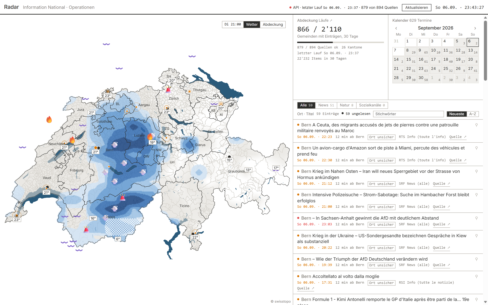
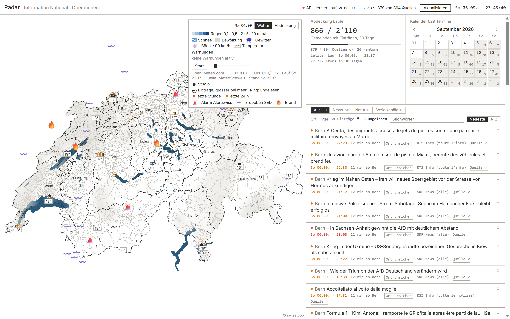
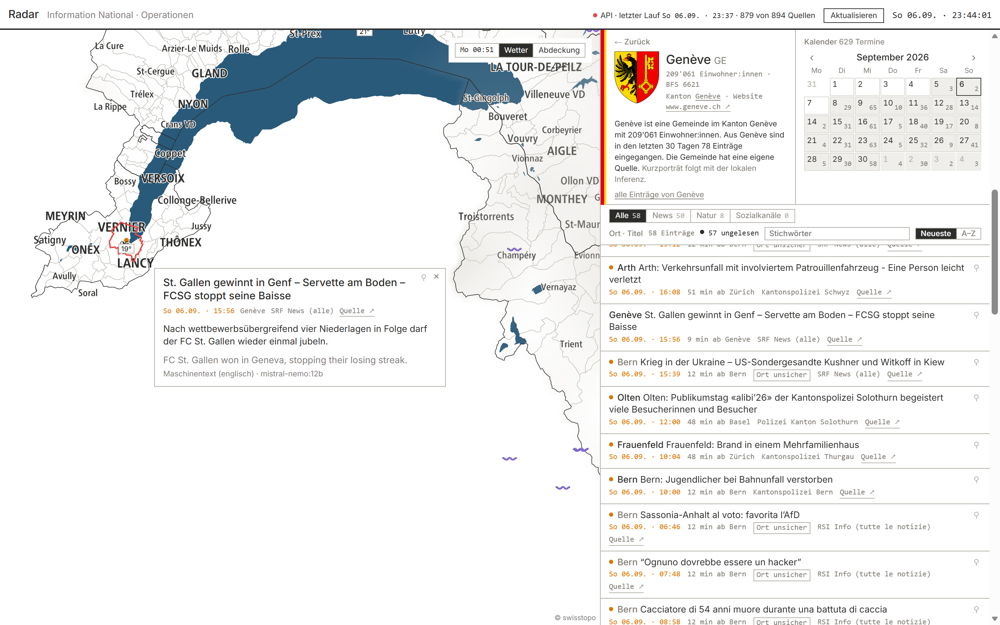
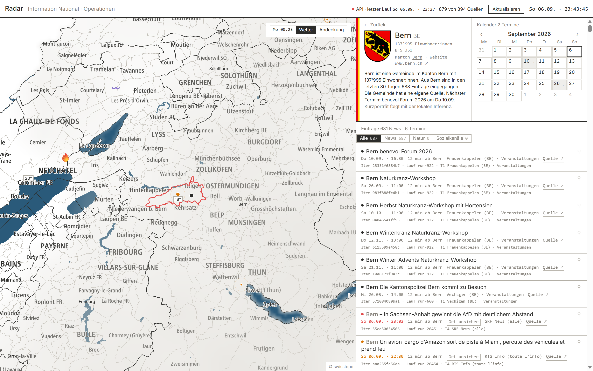
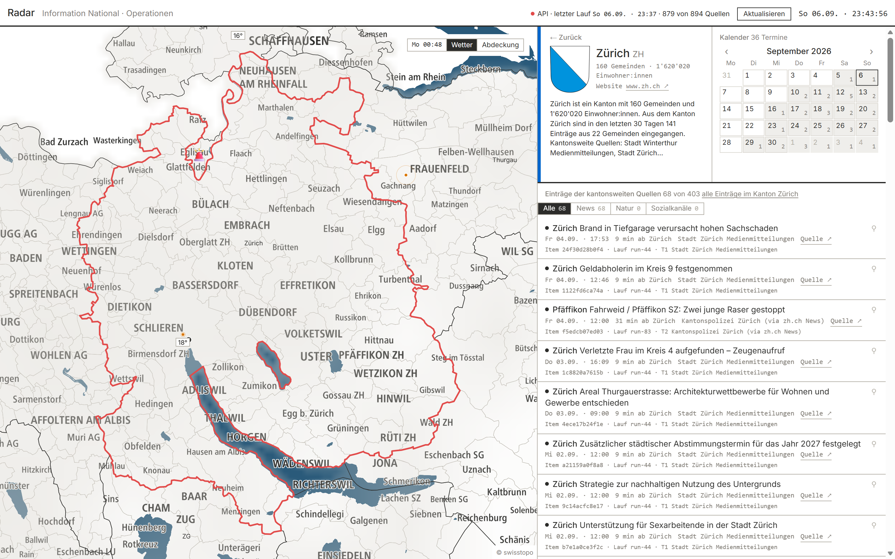
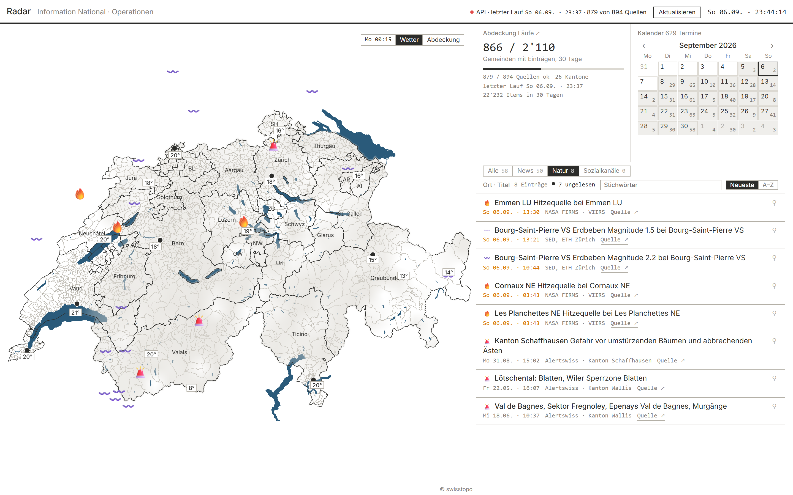
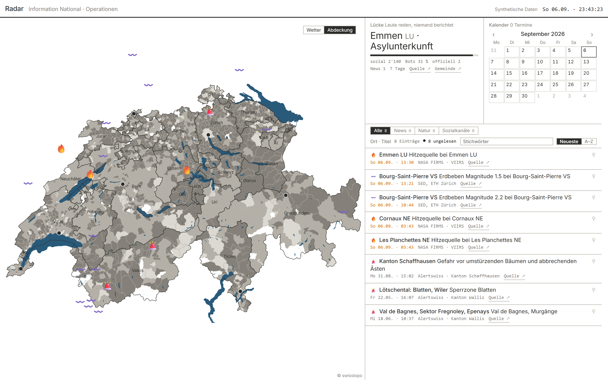
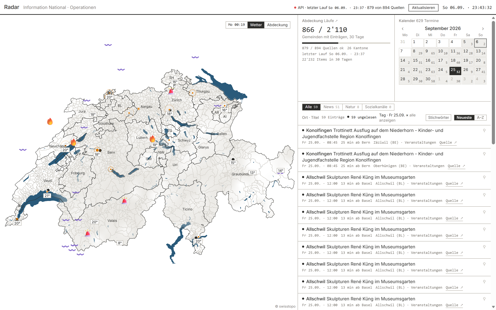
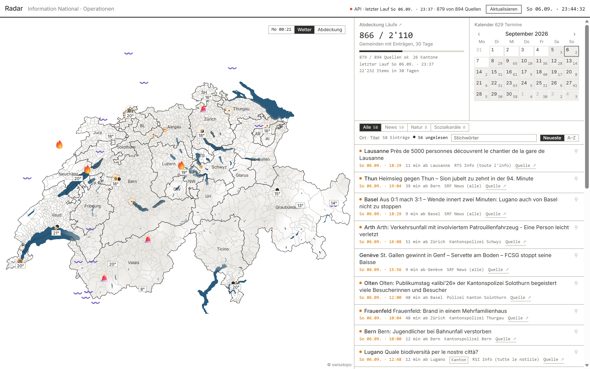

# Radar

**One picture instead of ten tabs.** An assignment-desk radar for Swiss regional news: what happened overnight, where,
and what is coming — read from the official layer of all 2'110 municipalities, on one machine, at zero running cost.



Radar polls **894 sources** — the municipalities' own feeds and list pages, all 26 cantonal police forces, the cantonal
portals, and SRF, RTS, RSI and RTR — places every item on the map by its **BFS municipality number**, and shows the
last 24 hours beside a forward calendar of dated municipal events. It also carries the weather forecast field,
MeteoSwiss warnings, federal alerts, earthquakes and satellite heat detections.

---

## What it does

| | |
|---|---|
| **Every municipality, even thin** | 894 sources, 879 fetching; 866 of 2'110 municipalities delivered something in the last 30 days. ~1'100–1'500 new items a day. |
| **Placed, not name-matched** | Every item hangs off a BFS number, so the map, the entity pages, the localities and the calendar all agree, and cross-language matching comes free. Where the placing is right it is *explainably* right — the evidence is stored with the item. |
| **A forward calendar** | 8'811 dated municipal events in 30 days, read out of iCal, JSON and CMS calendars. No product on the market has this layer. |
| **Nature events in the same list** | Federal alerts 🚨, earthquakes 〰️, satellite heat sources 🔥 and MeteoSwiss warnings ⛈️ 💨 ❄️ stand among the news, each with its emoji where a news row carries its unread dot. A warning is drawn as a zone, not a point. |
| **NASA satellite data** 🔥 | Active heat detections from **NASA FIRMS** — VIIRS on Suomi NPP, 375 m resolution, near-real-time — pulled over the Swiss bounding box each cycle and placed on the municipality whose borders hold the point. Low-confidence detections are dropped; the rest name the satellite, their confidence and their radiative power. The wording says plainly that a detection is **not a confirmed fire**: the first three were an industrial plant in Emmen and two sites in Neuchâtel, which is exactly what this data does. |
| **Local AI, on a short leash** | A model on the workstation condenses text that overflows the box, adds cited context where there is too little, and sorts national items by place. It runs offline; every output passes guards before it is stored. |
| **No babysitting** | One process. Nothing fetches unless a dashboard is open. Nothing leaves the machine. |

## The dashboard

| | |
|---|---|
|  | **The weather layer** — the ICON forecast field as rain, snow and cloud, storm cells as ⛈️ and 💨, MeteoSwiss warning zones as outlines, a scrubber through 48 forecast hours. |
|  | **An item** — a click opens it over the map with its municipality's card. The source's own words on top; under them, when the text is too thin, the local model's English context, labelled with the model that wrote it. |
|  | **A municipality** — coat of arms, population, its own calendar, every item gathered in 30 days, and which sources feed it. |
|  | **A canton** — its municipalities, its cantonal sources, and everything they filed. |
|  | **Nature** — one segment narrows the list to alerts, quakes, heat sources and warnings in force; the map drops the news pings and keeps the marks. |
|  | **Coverage** — which municipalities have a source and which CMS they run. This map is what drives the crawl. |
|  | **The calendar** — a day narrows the list to that day's events. |
|  | **Regional first** — international stories fold to the foot of the list, so the first screen is Lausanne, Thun, Basel, Arth, Genève rather than the day's world news. |

## How it works

```
config/sources.json ─┐
                     ├─→ ingest cycle ─→ SQLite (items, candidates, runs)
polite fetch layer ──┘        │                   │
  robots.txt, ETag,           │                   ├─→ local inference (Ollama)
  per-/24 rate limit,         │                   │     · summarise to fit the box
  backoff, every fetch a run  │                   │     · place the national items
                              ├─ gazetteer ── place by name → BFS number
                              ├─ rules ─────── topic, language, tier
                              └─→ export ─→ the dashboard (map, list, calendar)
```

**Fetching is polite by design.** robots.txt honoured with every override recorded on the source that got it,
conditional requests, one request per second per /24 network, automatic backoff to 24 h, every fetch logged as a run.
No headless browser per source, no login-walled content, no personal-data enrichment. One hosting provider dropped the
crawler when six workers hit 500 of its sites at once — the rate limit is per *network* since, not per host.

**Placing is rules-first and explainable.** A gazetteer of municipalities, localities, cantonal adjectives and
exonyms, with the source's own home as the anchor. Measured by hand: ~80 % right on national and police news, ~93 % on
dated events, effectively 100 % on a municipality's own feed.

**The model is local and never trusted.** It runs through Ollama on the workstation's GPU; a switch turns every model
call off and nothing breaks — the queue simply waits. Its text may not contain a number or a person's name the source
material does not have. It may move an item only to a place the item's *own text* names, and only if that name
resolves through the same gazetteer as everything else — and it may say an item is not about Switzerland, which takes
it off the map. Everything else keeps the rule-based placement, which stays the reference and can be restored in one
command.

**Every output is read by a human before it is switched on.** The summariser passed four rounds and 195 texts; three
of those rounds stopped the rollout and changed the guards. The placer's 602 decisions were read twice: the first pass
caught the word «Zug» matching inside «Zugbegleitende» and filing a national story in the canton of Zug, which is
exactly the class of mistake that would end the tool's usefulness. The guard now matches on word boundaries.

**No framework.** TypeScript, Vite, MapLibre and Node's built-in SQLite — no runtime dependency that needs a compiler,
so it runs the same on a workstation and on a bare Debian box. Day mode, one red, no rounded corners, no gradients.

## What it is not

It does not push, alert, digest or export; there is no login and no second viewer; the read state lives in one
browser. It is not public-facing, and it holds no editorial judgement about what deserves a crew — only what happened,
where, and what the source said. Comment sources are built as a shell with **no source connected**: the platforms
either require their own approval or have no API, and scraping a publisher's comment section is not something this
project does.

---

*Data sources are used under their own terms: swisstopo boundaries, Wikidata, Open-Meteo (CC BY 4.0) over MeteoSwiss
ICON-CH1/CH2, MeteoSwiss warnings, Alertswiss (BABS), the Swiss Seismological Service at ETH Zürich, NASA FIRMS, and
the official publications of the municipalities, cantons and cantonal police forces. Screenshots show the running tool
with live data on the date they were taken.*
